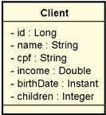

# CRUD DE CLIENTES
<p align='center'> 
    
      
</p>

[](https://github.com/MedeirosGiana/customer-registration-spring-boot.git/blob/main/LICENSE)
#### Projeto Java Spring Boot contendo CRUD completo de Web Services Rest, para acesso aos recursos de cliente conforme abaixo:

- Busca paginada de clientes, podendo ser personalizada,
- Busca de cliente por id informado
- Buscar todos os clientes,
- Atualizar cliente,
- Deletar cliente.

### Modelo de domínio:



#### Passo a passo:
- Setap inicial do projeto com Spring Initializr version 3.1.1,
- Configuração do banco de dados em memória H2,
- Criação do modelo de dados para mapeamento de entidades no banco de dados,
- Seeding no banco de dados para teste,
- Desenvolvimento das operações de CRUD para acessos aos recursos dos clientes,
- Tratamentos de erros, exceções e validações.

#### Pré-requisitos para execução do projeto:
- Ter instalado o Java 11 ou versões superiores,
- Maven 3.6.3 ou versões superiores,
- Intellj IDEA Community Edition ou sua IDE de preferência,
- Controle de versão GIT instalado na sua máquina.
- Postam

#### Acesso ao projeto:
- Fazer o clone do projeto na sua máquina:
 ```shell script
https://github.com/MedeirosGiana/customer-registration-spring-boot.git
```
- Para executar o projeto no terminal, digite o seguinte  comando:
```shell script
mvn spring-boot:run 
```

Feito isso, basta acessar o **Postman** e realizar as operações de CRUD, para atualizar e inserir cliente, pode ser utilizado os dados fictícios abaixo:
```shell script
{
    "name": "Maria Silva",
    "cpf": "12345678901",
    "income": 6500.0,
    "birthDate": "1994-07-20",
    "children":2
}
```

#### Tecnologias utilizadas
- Java
- Spring Boot
- JPA / Hibernate
- Maven
- Banco em memória H2

#### Ferramenta utilizada
- Postman

#### Desenvolvedora
- Giana Medeiros - https://www.linkedin.com/in/gianamedeiros/
